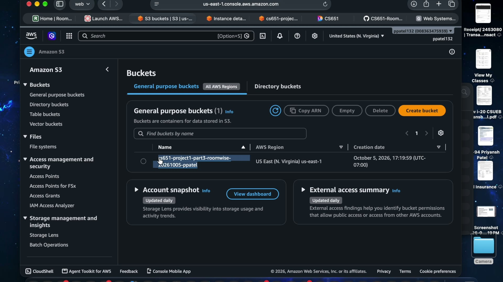
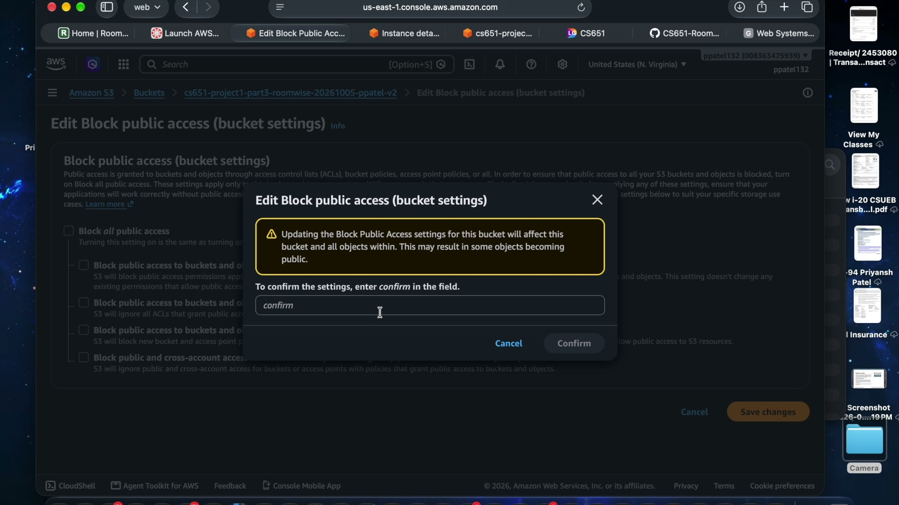
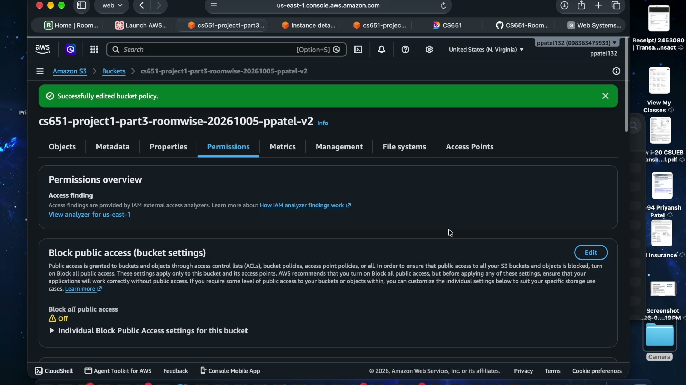
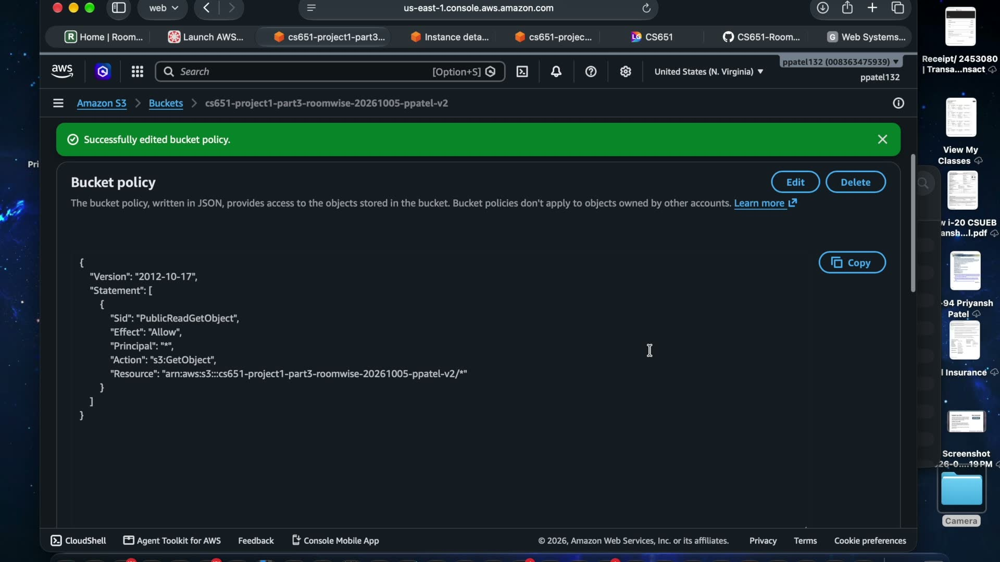
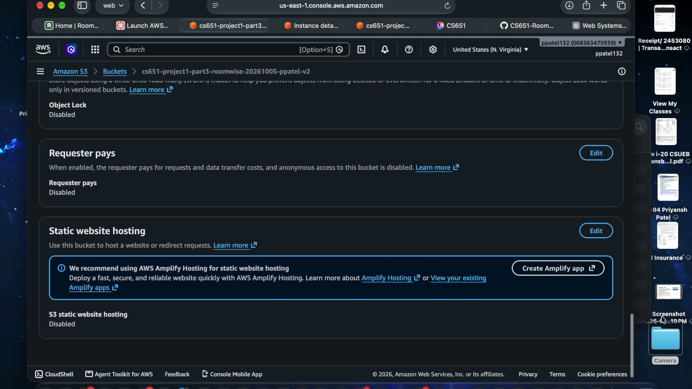
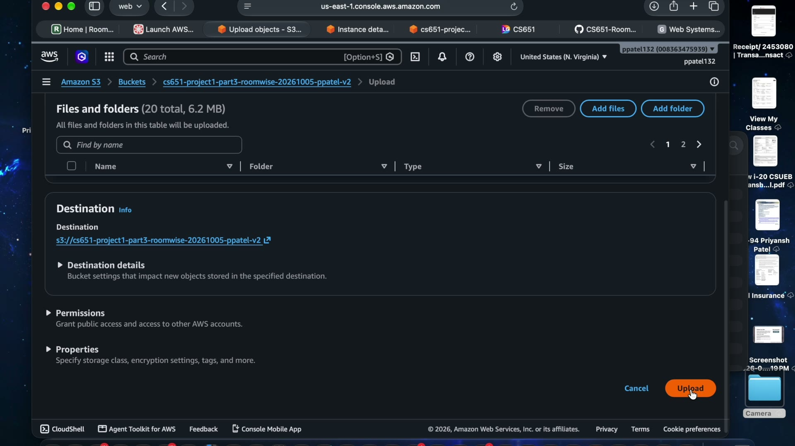
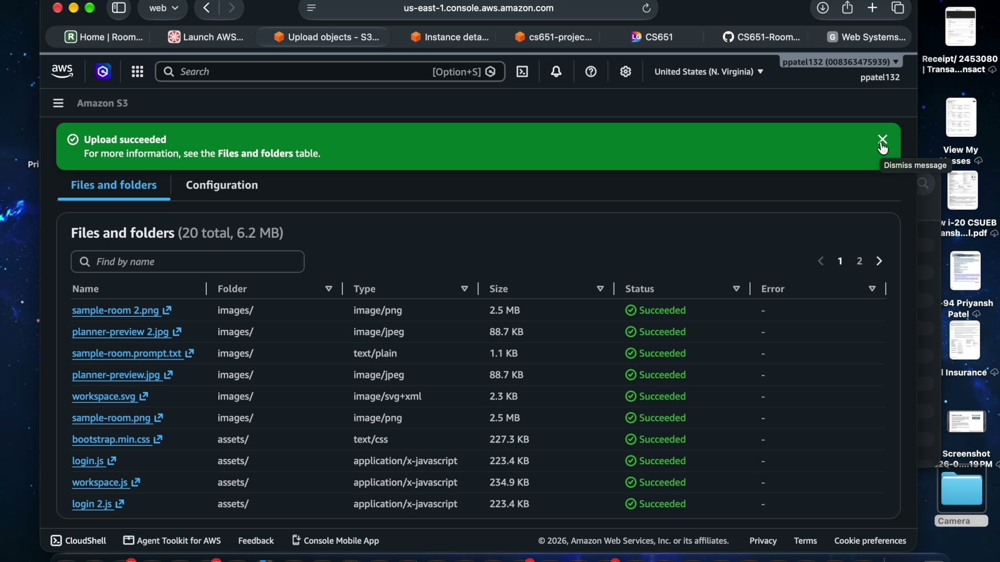
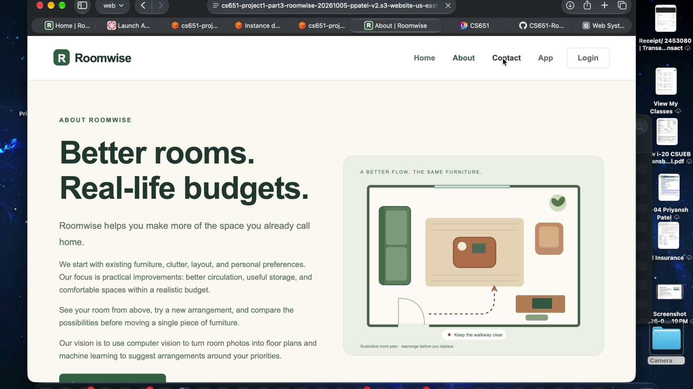

# CS651 Project 1 — Part 3: Roomwise on AWS S3

**Deployed site:** http://cs651-project1-part3-roomwise-20261005-ppatel-v2.s3-website-us-east-1.amazonaws.com
**Demo video:** https://www.youtube.com/watch?v=cL4AlFdA0dI
**Team:** Roomwise group (based on `sean10203040/CS651-Website-Project`)

Part 3 re-deploys the Roomwise static site on **Amazon S3 static website hosting**.
Part 2 used Docker + EC2 (a server); Part 3 needs no server and no container —
S3 serves the compiled files directly over HTTP.

## Deployment steps

### 1. Create the bucket
In the S3 console, create a bucket with a globally unique name. Ours:
`cs651-project1-part3-roomwise-20261005-ppatel-v2`, region `us-east-1` (N. Virginia).

### 2. Open public access (default is deny)
S3 blocks all public access by default. Under **Permissions**, edit *Block public
access*, uncheck all four settings, and type `confirm`.

### 3. Attach the public-read bucket policy
Add a bucket policy granting `s3:GetObject` to everyone (`"Principal": "*"`) —
this makes every file in the bucket readable by visitors.

### 4. Enable static website hosting
Under **Properties** → *Static website hosting* → Enable, with `index.html` as
the index document. S3 returns the website endpoint URL — the public address.

### 5. Upload the compiled site
Upload the contents of the compiled `dist/` folder: `index.html`, `app.html`,
`login.html`, plus `assets/` and `images/`. Node is build-time only (it compiles
the React app); S3 receives plain static files. 20 files, 6.2 MB.

### 6. Open the endpoint and verify
Back on **Properties**, click the *Bucket website endpoint* link. Roomwise loads
with the S3 URL visible in the address bar.

## Issues encountered

- **Second attempt (v2 bucket).** Our first bucket needed a redo — this recording
  is the second run.
- **403 Forbidden until public access is configured.** S3's default-deny means
  the site returns 403 until *both* Block Public Access is off *and* the
  public-read bucket policy is attached. Until both are set, nothing loads.

## Cost

Approximate public S3 pricing (us-east-1); our actual spend was $0 inside the
course Learner Lab:

| Item | Approx. price | This project |
|---|---|---|
| Storage (S3 Standard) | ~$0.023 / GB / month | 6.2 MB → ~$0.0001 / month |
| PUT requests | ~$0.005 / 1,000 | 20 files → ~$0.0001 |
| GET requests | ~$0.0004 / 1,000 | class demo traffic → ~$0.00 |
| Data transfer out | first 100 GB / month free | $0.00 |

**Bottom line:** hosting this site on S3 costs fractions of a cent per month —
effectively free at this scale, versus an always-on EC2 instance in Part 2.

## Repository contents

Full site source (based on the group repo): static HTML pages, `styles.css`
(Roomwise design system), Bootstrap 5.3.3, React 18 SPA source (`workspace.jsx`,
`login.jsx`, reusable `components.jsx`), images and supporting files. Build with
`node build.mjs` (esbuild) to regenerate `dist/`.

## Wiki

- **YouTube Link** — demo video (deployment + running site + URL + issues)
- **S3 Bucket Setup** — screenshots of the bucket and uploaded content above
